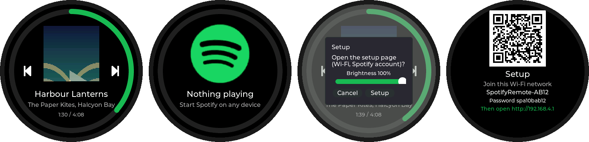
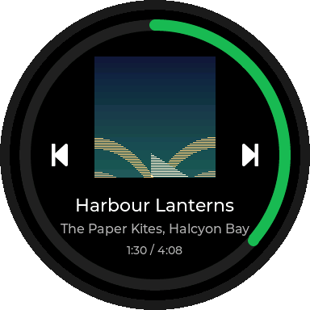
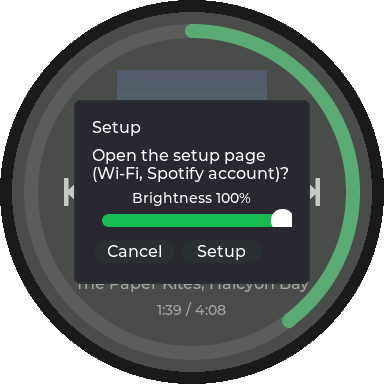
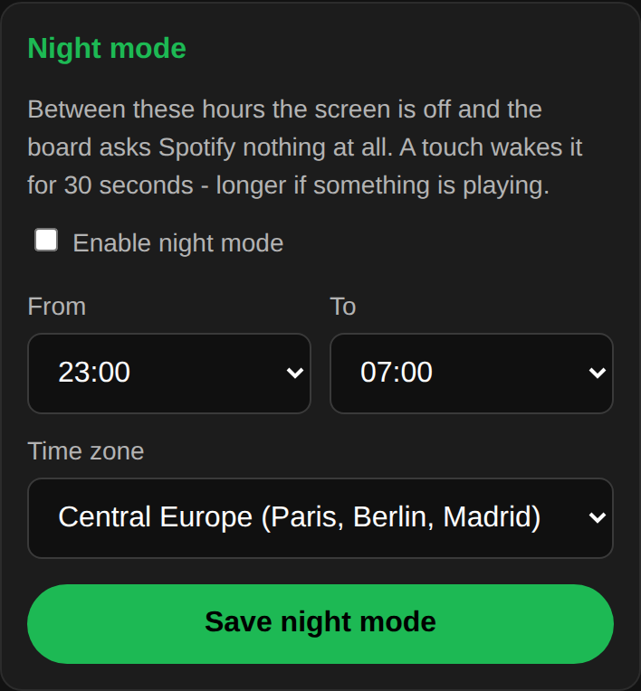
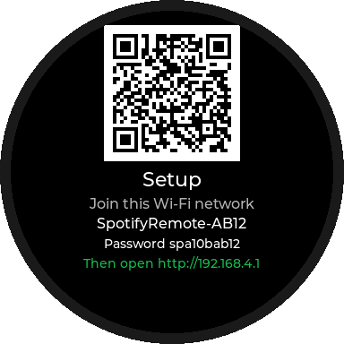
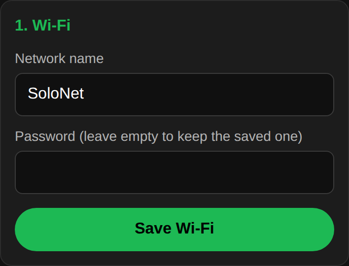
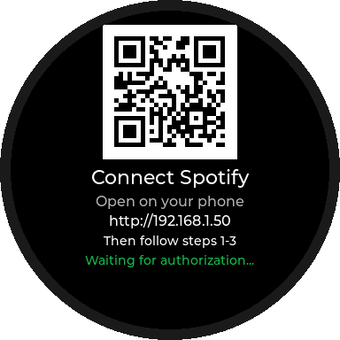
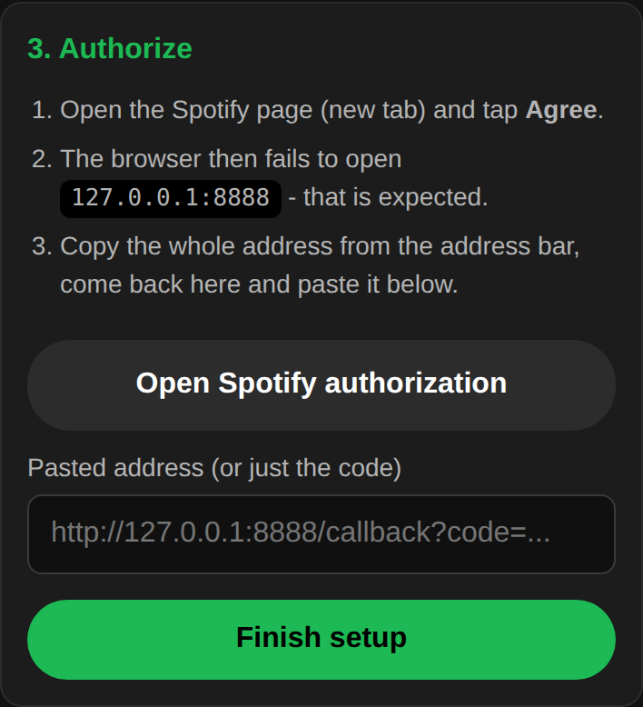

# esp32-spotify-remote

A Spotify remote for a 1.8" round 360×360 touchscreen (ESP32-S3,
JC3636W518EN class bought from Aliexpress) powered by USB-C, built with Claude AI. It shows the current track with its cover art and a
progress ring, and lets you play, pause and skip by touching the screen.

It talks to the Spotify Web API directly over HTTPS — no third-party Spotify
library, no cloud service of ours in between, nothing but your board and
`api.spotify.com`.



**Nothing is compiled in.** No credentials live in the source, so the same
binary works for anybody: a freshly flashed board opens its own Wi-Fi network
and walks you through setup from your phone. That is also why a
[pre-built image](#option-a--flash-the-pre-built-image) can be published at all.

---

## Contents

- [What it does](#what-it-does)
- [What you need](#what-you-need)
- [Option A — flash the pre-built image](#option-a--flash-the-pre-built-image)
- [Option B — build it yourself in the Arduino IDE](#option-b--build-it-yourself-in-the-arduino-ide)
- [First start, step by step](#first-start-step-by-step)
- [Using it day to day](#using-it-day-to-day)
- [How it works inside](#how-it-works-inside)
- [Troubleshooting](#troubleshooting)
- [Licence and trademarks](#licence-and-trademarks)

---

## What it does

**Playback**  ·  The cover art, the track title and the artists, the elapsed and
total time, and a progress ring around the edge of the panel. The ring advances
between polls from the local clock, so it moves smoothly rather than in
three-second steps. Touch the artwork to play or pause — the screen reacts at
once and a translucent ▶/❚❚ disc confirms it, without waiting for the network.



**Navigation**  ·  ⏮ and ⏭ either side of the artwork, with 64-pixel round touch
areas so they are comfortable on a small round panel. Covers for the next track
are fetched ahead of time, so skipping usually shows the new artwork instantly.

**Brightness**  ·  Hold a finger anywhere on the screen for 5 seconds. A window
opens with a slider from 10 % to 100 % in steps of 10. The panel follows the
slider as you drag it; the value reaches flash when you lift your finger, so one
adjustment is one write. The screen still dims to 10 % after 10 idle seconds
when nothing is playing, and comes straight back on a touch.



**Night mode**  ·  Pick two hours on the setup page and between them the screen
is off and the board asks Spotify nothing at all — no polling, no artwork, no
token refresh, and the TLS session is closed. A touch wakes it for 30 seconds;
if something is playing that keeps rolling forward, so it goes back to sleep
30 seconds after playback stops. The window may cross midnight (23:00 → 07:00).
The board learns the time over SNTP, and until it has an answer it never counts
anything as night — a board that cannot reach a time server simply behaves as if
night mode were off.



**Setup from the device itself**  ·  Wi-Fi, the Spotify app credentials and the
authorization are all done from a page the board serves. Hold the screen for
5 seconds to reach it again later, or use it to hand the board to a different
Wi-Fi network or a different Spotify account.

---

## What you need

| | |
|---|---|
| **Board** | ESP32-S3 with a 1.8" round 360×360 ST77916 panel and a CST816S touch controller — sold as **JC3636W518EN** and similar. 16 MB flash and OPI PSRAM. |
| **Spotify account** | **Premium.** Spotify's own documentation says of the playback endpoints: "This API only works for users who have Spotify Premium." A free account can be read but not controlled. |
| **A Spotify app of your own** | Two minutes in the [developer dashboard](https://developer.spotify.com/dashboard). See below for why you need your own. |
| **A phone or PC** | Only for the one-time setup. |

### Why everyone needs their own Spotify app

A Spotify app starts in *development mode*, which allows **up to 5 authenticated
users**, each added by hand under Settings → User Management. The way out of that
cap — *extended quota mode* — has, since May 2025, been open only to established
organisations that can show around 250,000 monthly active users.

So there is no way to ship one shared app that strangers can sign in to. Every
person running this firmware creates their own app, which takes a couple of
minutes and is what the setup page asks for. It also means your listening never
passes through anybody else's credentials.

---

## Option A — flash the pre-built image

For anyone who would rather not install an IDE. The image is credential-free and
identical for everybody; everything personal is entered afterwards on the device.

Download `esp32-spotify-remote-<version>.bin` from the
[releases page](https://github.com/xsvgnt/esp32-spotify-remote/releases) and
check it against `SHA256SUMS.txt`.

### With a browser (nothing to install)

1. Open [espressif.github.io/esptool-js](https://espressif.github.io/esptool-js/)
   in Chrome or Edge (Web Serial is not available in Firefox or Safari).
2. Plug the board in and press **Connect**, then pick its serial port.
3. Add the file at offset **`0x0`**, tick **Erase all flash before write** for a
   first install, and press **Program**.
4. Unplug and replug the board when it finishes.

### With esptool on the command line

```bash
pip install esptool
esptool.py --chip esp32s3 --baud 921600 write_flash -z 0x0 esp32-spotify-remote-1.0.0.bin
```

The single file already contains the bootloader (`0x0`), the partition table
(`0x8000`), the OTA data (`0xe000`) and the application (`0x10000`).

> **If the board does not appear as a serial port**, hold **BOOT**, tap
> **RESET**, release **BOOT**, and try again. Some boards need the
> [CH340](https://www.wch-ic.com/downloads/CH341SER_EXE.html) or
> [CP210x](https://www.silabs.com/developer-tools/usb-to-uart-bridge-vcp-drivers)
> driver on Windows.

Nothing you enter later is in this image: your credentials live in the board's
NVS partition, which the image does not touch. Erasing the flash, or
"Forget everything" on the setup page, returns the board to a first boot.

---

## Option B — build it yourself in the Arduino IDE

### 1. The ESP32 core

In the Arduino IDE, **File → Preferences → Additional boards manager URLs**, add:

```
https://raw.githubusercontent.com/espressif/arduino-esp32/gh-pages/package_esp32_index.json
```

Then **Tools → Board → Boards Manager**, search for `esp32` by Espressif
Systems, and install **exactly 3.0.7**. Newer 3.x releases will very likely work,
but 3.0.7 is what this firmware is built and tested against.

### 2. The libraries

**Versions matter here, and LVGL matters most of all.** This project targets
**LVGL 8.4.0**. LVGL 9 rewrote the display and input driver API
(`lv_disp_drv_t`, `lv_disp_draw_buf_init`, `lv_msgbox_create` and others are all
gone or different), so the sketch will not compile against it. If the Library
Manager offers you 9.x, open the version dropdown and pick 8.4.0.

| Library | Version | Where |
|---|---|---|
| **lvgl** | **8.4.0 — not 9.x** | Library Manager |
| ESP32_Display_Panel | 0.1.4 | Library Manager |
| ESP32_IO_Expander | 0.0.2 | Library Manager (pulled in by the panel library) |
| ArduinoJson | 7.x (built with 7.4.3) | Library Manager |
| JPEGDEC | 1.8.4 | Library Manager |

`ESP32_Display_Panel` changed its API in 0.2.x (everything moved into an
`esp_panel::` namespace), so 0.1.4 is required as well.

### 3. lv_conf.h — the step people miss

LVGL reads its configuration from an `lv_conf.h` that sits **next to** the `lvgl`
folder, not inside it. Copy the one from this repo:

```
Arduino/libraries/lv_conf.h     <-- copy extras/lv_conf.h here
Arduino/libraries/lvgl/
```

(`Arduino/` is your sketchbook folder: `~/Documents/Arduino` on macOS and
Windows, `~/Arduino` on Linux.)

The supplied file is the stock LVGL 8.4 template with these changes, all of
which the firmware depends on:

| Setting | Value | Why |
|---|---|---|
| `LV_COLOR_16_SWAP` | `1` | the ST77916 takes RGB565 big-endian |
| `LV_TICK_CUSTOM` | `1`, using `millis()` | LVGL gets its time from Arduino |
| `LV_FONT_MONTSERRAT_14/16/22/32` | `1` | the four sizes the UI uses |
| `LV_USE_QRCODE` | `1` | the QR codes on the setup screens |
| `LV_MEM_SIZE` | 96 KB, allocated in PSRAM | keeps LVGL out of internal RAM |
| `LV_USE_PERF_MONITOR` | `0` | no FPS overlay |

If you already have an `lv_conf.h` for another project, merge these settings
rather than overwriting it.

### 4. Tools menu

Open `esp32-spotify-remote.ino` and set **Tools** exactly as follows. The ones in
bold will stop the board working if they are wrong.

| Menu | Value |
|---|---|
| Board | **ESP32S3 Dev Module** |
| **PSRAM** | **OPI PSRAM** |
| **Flash Size** | **16MB (128Mb)** |
| **Partition Scheme** | **Huge APP (3M No OTA/1MB SPIFFS)** |
| **Flash Mode** | **QIO 120MHz** |
| USB CDC On Boot | Enabled *(so the serial log appears)* |
| Arduino Runs On | Core 1 |
| Events Run On | Core 1 |
| CPU Frequency | 240 MHz |
| Upload Speed | 921600 |

Then **Upload**. The build is about 1.6 MB, half of the 3 MB application
partition.

> The pre-built image in the releases is built with **16M Flash (3MB APP/9.9MB
> FATFS)** and **QIO 80MHz**, since 120 MHz is marked experimental by Espressif
> and not every flash chip is happy with it. Either partition scheme gives the
> same 3 MB application space, and the image carries its own partition table, so
> flashing it does not depend on what is selected here.

### Serial log

`esp32-spotify-remote.ino` starts with:

```c
#define APP_LOG_LEVEL 3   // 0 = off, 1 = errors, 2 = + warnings, 3 = + info, 4 = + debug
```

At level 0 every log call compiles away to nothing — no strings in flash, no
formatting at runtime. Level 3 is a good default; level 4 adds one line per HTTP
request. Open the Serial Monitor at **115200**.

---

## First start, step by step

A board with nothing stored goes straight to step 1. To reach this again later,
hold a finger on the screen for 5 seconds and choose **Setup**.

### 1. Join the board's Wi-Fi network

The screen shows a network name, a password, and a QR code that joins the
network when scanned with a phone camera.



Join it, then open **http://192.168.4.1** — the address is on the screen too.
Most phones offer the page by themselves, as a captive portal.

### 2. Enter your Wi-Fi



Pick your network from the list (the board scans while the page is open) and
type its password, then **Save Wi-Fi**. The board tries the credentials before
storing them, so a typo cannot lock you out — it tells you instead.

### 3. Create your Spotify app

In a browser, on the [developer dashboard](https://developer.spotify.com/dashboard):

1. **Create app**. Any name and description will do.
2. Set the **Redirect URI** to exactly:
   ```
   http://127.0.0.1:8888/callback
   ```
   Spotify requires HTTPS for redirect URIs *except* loopback addresses, where
   HTTP is permitted — and it does not accept the name `localhost`, only the
   explicit `127.0.0.1`. Nothing ever listens on that address; see
   [how the authorization works](#the-authorization-paste-back) below.
3. Tick the **Web API** checkbox and save.
4. Under **Settings → User Management**, add yourself: your name and the e-mail
   address of your Spotify account. An app in development mode only works for
   users on that list.
5. Copy the **Client ID**, and **View client secret** for the other one.

Paste both into section 2 of the setup page and press **Save Spotify app**.

### 4. Restart, and reopen the page over your own Wi-Fi

Press **Restart now**. The board joins your network and the screen shows its new
address — open that in your browser. (Your phone has to leave the board's
network to reach Spotify, which is why this step exists.)



### 5. Authorize



1. **Open Spotify authorization** — a new tab asks you to agree.
2. After you agree, the browser tries to open `127.0.0.1:8888` and fails. **That
   is expected.** The address bar is what matters.
3. Copy the whole address, paste it into the box, and press **Finish setup**.

The board pulls the authorization code out of it, exchanges it for a refresh
token, and stores that. Playback appears within a few seconds.

### 6. Optional: night mode

Set the hours and your time zone in the night mode card, then **Save night
mode**. The zone list is pre-selected from the browser you are using, and each
entry is a POSIX rule including daylight saving, so you set it once rather than
twice a year.

---

## Using it day to day

| Gesture | What happens |
|---|---|
| Touch the artwork | Play / pause |
| Touch ⏮ / ⏭ | Previous / next track |
| Hold anywhere for 5 s | The settings window: brightness, and the way back to the setup page |
| Touch anything at night | Wakes the screen for 30 s (longer while a track plays) |

The setup page also has **Restart** and **Forget everything**. Forgetting erases
the Wi-Fi credentials, the Spotify app and the authorization, and the board comes
back up as if freshly flashed.

---

## How it works inside

### The authorization (paste-back)

Spotify only sends an authorization code to a registered redirect URI, and only
allows plain HTTP on loopback addresses. A board on your network is not a
loopback address of the phone you are holding, and it has no HTTPS certificate,
so it cannot receive the redirect itself.

So the redirect goes where it always goes — `http://127.0.0.1:8888/callback` —
and fails to load, because nothing is listening there. The code is in the
address bar regardless. You paste that address back into the board's page, and
the board does the token exchange itself. Nothing is hosted anywhere, no proxy
sees your code, and the registered redirect URI never changes. A random `state`
value is generated per attempt and checked on the way back.

The board then holds only a refresh token. It is exchanged for a one-hour access
token as needed, renewed a minute before expiry. (Spotify's refresh tokens stop
working after about six months of disuse; the board will tell you on screen and
send you back to step 5.)

### What is stored, and where

Everything lives in one NVS record with a magic number, a version and a CRC.
NVS writes a new entry before invalidating the old one, so a single-key write is
atomic: a power cut leaves either the complete previous record or the complete
new one, never a Wi-Fi name without its password. A record that fails its CRC is
ignored and the board starts its setup portal.

**NVS is not encrypted.** Anyone with a USB cable and `esptool` can read your
Spotify refresh token and Wi-Fi password out of a board they physically hold —
as they could from almost any hobby ESP32 project, and the Wi-Fi stack stores its
own copy of the password anyway. Treat a board you give away or throw out the way
you would treat a logged-in device: press **Forget everything** first.

### Architecture

Two tasks. `net_task` on core 0 owns the network: it polls
`GET /me/player` every 3 seconds, sends the play/pause/next/previous commands,
downloads and decodes cover art, and runs the setup portal. LVGL runs on core 1
and touches nothing else — the two share a `PlayerState` behind a mutex and a
FreeRTOS command queue, and the UI redraws from a snapshot every 100 ms.

Cover art is downloaded from `i.scdn.co` with a separate short-lived TLS
connection, decoded straight into a PSRAM buffer with JPEGDEC at the largest
reduction that still fills 150 px, and handed to LVGL by the copy flag. The next
track's cover is prefetched into a second buffer, keyed on the track id, so a
skip usually has its artwork ready.

The API connection is one keep-alive TLS session with `HTTPClient`, verified
against the ESP-IDF's bundled root store. 401 triggers exactly one token refresh
and one retry, keyed on the status code rather than the error text. 429 and 5xx
back off exponentially and honour `Retry-After`.

### Repository layout

```
esp32-spotify-remote.ino   entry point; setup() and a loop() that only runs LVGL
spotify_api.h              logging, boot diagnostics, Wi-Fi, SNTP, tokens, HTTP
spotify_ui.h               LVGL UI, artwork pipeline, net_task, night mode
app_config.h               the NVS record: read, write, version, CRC
setup_portal.h             the access point, the setup page, the paste-back flow
scr_st77916.h              vendor panel bring-up, unmodified
pincfg.h                   vendor pin map, unmodified
logo_img.h                 the Spotify mark shown when nothing is playing
extras/lv_conf.h           the LVGL configuration described above
docs/                      the screenshots in this README
```

---

## Troubleshooting

**The screen stays black after flashing.** Almost always PSRAM or the flash
mode: check **OPI PSRAM**, **16MB**, **QIO 80MHz**. The serial log at 115200
prints the chip, flash and PSRAM it found on every boot.

**It compiles with pages of errors about `lv_disp_drv_t` or `lv_msgbox_create`.**
LVGL 9 is installed. Downgrade to 8.4.0.

**`lv_conf.h` not found, or the screen shows garbled colours.** The file is in
the wrong place or is not the one from `extras/`. It belongs beside the `lvgl`
folder, and needs `LV_COLOR_16_SWAP 1`.

**"Premium required" on screen.** Spotify's playback endpoints only work for
Premium accounts.

**Nothing happens when you press play, and the log shows 403.** Your Spotify
account is not on the app's user list — add it under Settings → User Management.

**The board never connects after a power cut at the wrong moment.** The stored
record failed its checksum and was discarded; the setup portal will be up. Enter
the details again.

**The clock never sets, so night mode never starts.** The board needs to reach
`pool.ntp.org`. Some routers intercept or block NTP; the setup page's status card
shows whether the clock is set.

---

## Known Issues

Only ASCII characters are supported. Accented characters are changed to their ASCII equivalent.
Chinese, Japanese or other scripts are rendered as boxes.


---

## Licence and trademarks

This project is released under the [MIT licence](LICENSE).

`scr_st77916.h` and `pincfg.h` come from the board manufacturer's example code
and are kept unmodified.

**Spotify** is a trademark of Spotify AB. This project is an unofficial,
non-commercial hobby project and is **not affiliated with, endorsed by or
sponsored by Spotify AB**. The Spotify mark in `logo_img.h` is used only to
indicate that the device controls Spotify playback, following Spotify's
[design guidelines](https://developer.spotify.com/documentation/design); it is
not modified or recoloured. Use of the Web API is subject to Spotify's
[Developer Terms](https://developer.spotify.com/terms). If you fork this for
anything commercial, read those first — and replace `logo_img.h` with an image
of your own if in doubt.
